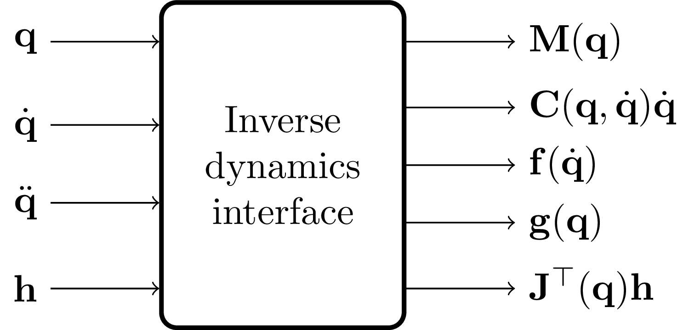

# inverse_dynamics_interface

This package provides a superclass for a generic inverse dynamics interface.



Given a dynamic model in the form `M(q) * ddq + C(q,dq) * dq + f(dq) + g(q) + J(q) * h = tau`, this library can return the following values:

* **getInertiaMatrix(q)** returns the inertia matrix `M(q)`, as a function of joint positions `q`;
* **getCoriolisVector(q)** returns the Coriolis and centrifugal effects vector `C(q,dq) * dq`, as a function of joint positions `q` and velocities `dq`;
* **getGravityVector(q)** returns the gravity vector `g(q)`, as a function of joint positions `q`;
* **getFrictionVector(dq)** returns the possibly nonlinear friction vector `f(dq)`, as a function of joint velocities `dq`;
* **getExternalTorques(q, h)** returns the torques due to exerting external contact wrench `h`, by computing the Jacobian `J(q)`, as `J(q) * h`;
* **getDynamicParameters(q, dq)** returns the tuple (`H(q)`, `C(q,dq)`, `g(q)`);
* **getTorques(q, dq, ddq)** returns `H(q) * ddq + C(q,dq) * dq + g(q) + J(q)*h`.

Please check the [InverseDynamicsInterface](./include/inverse_dynamics_interface/inverse_dynamics_interface.hpp) class for more information.

## Usage

A plugin implementing the interface must be initialized before usage, via the [`initialize()`](./include/inverse_dynamics_interface/inverse_dynamics_interface.hpp#L0046) method.
This method accepts a `NodeParametersInterface` through which the [configuration parameters](#configuration) must be passed under the correct namespace, together with the `robot_description` (in string format) the dynamics shall be solved for.
Please refer to the method documentation for more information.

## Configuration

The plugin can be (optionally) configured with parameters, to pass via the node parameters interface.
The necessity and effectiveness of these parameters depend on the specific implementation.
For the time being, only the [KDL-based plugin](../inverse_dynamics_interface_kdl/include/inverse_dynamics_interface_kdl/inverse_dynamics_interface_kdl.hpp) and the [Pinocchio-based plugin](../inverse_dynamics_interface_pinocchio/include/inverse_dynamics_interface_pinocchio/inverse_dynamics_interface_pinocchio.hpp) are affected by this configuration.
Thus, please refer to the related documentation ([KDL](../inverse_dynamics_interface_kdl/README.md#configuration) and [Pinocchio](../inverse_dynamics_interface_pinocchio/README.md#configuration)) for examples on how these parameters are configured.

## Demo

Demos and tests are available with concrete implementations of this library: please check [InverseDynamicsInterfaceKDL](../inverse_dynamics_interface_kdl/README.md#demo), [InverseDynamicsInterfacePinocchio](../inverse_dynamics_interface_pinocchio/README.md#demo), [InverseDynamicsInterfaceUR10](../inverse_dynamics_interface_ur10/README.md#demo) or [InverseDynamicsInterfaceFrankaInria](../inverse_dynamics_interface_franka_inria/README.md#demo).

### Evaluate the dynamics

You can evaluate the dynamics computing the torques corresponding to a sequence of `sensor_msgs/msg/JointState` messages by launching the [`evaluate_dynamics`](./launch/evaluate_dynamics.launch.py) demo.
Please refer to the launch files in [`inverse_dynamics_interface_kdl`](../inverse_dynamics_interface_kdl/launch/evaluate_dynamics.launch.py), [`inverse_dynamics_interface_pinocchio`](../inverse_dynamics_interface_pinocchio/launch/evaluate_dynamics.launch.py),  [`inverse_dynamics_interface_ur10`](../inverse_dynamics_interface_ur10/launch/evaluate_dynamics.launch.py) or [`inverse_dynamics_interface_franka_inria`](../inverse_dynamics_interface_franka_inria/launch/evaluate_dynamics.launch.py) to see how this demo can be configured with different plugins.

#### Visualize the results

Run the [plot_joint_state](./scripts/plot_joint_state.py) Python script to assess the performance of the dynamics evaluation, i.e. the comparison between ground truth (GT) and computed torques, where the GT torques are retrieved from the measured joint states, as mentioned above:

```bash
ros2 run inverse_dynamics_interface plot_joint_state.py -b BAG_FILES [BAG_FILES ...] -o OUTPUT_DIR
```

For additional information, run

```bash
ros2 run inverse_dynamics_interface plot_joint_state.py -h
```
