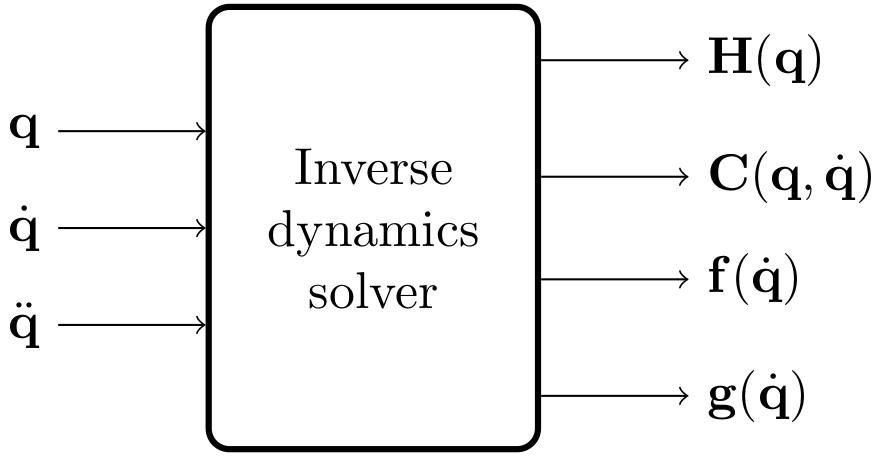

# inverse_dynamics_solver

This package provides a superclass for a generic inverse dynamics solver.



Given a dynamic model in the form `H(q) * ddq + C(q,dq) * dq + f(dq) + g(q) = tau`, this library can return the following values:

* **getInertiaMatrix(q)** returns the inertia matrix `H(q)`, as a function of joint positions `q`;
* **getCoriolisVector(q)** returns the Coriolis and centrifugal effects vector `C(q,dq) * dq`, as a function of joint positions `q` and velocities `dq`;
* **getGravityVector(q)** returns the gravity vector `g(q)`, as a function of joint positions `q`;
* **getFrictionVector(dq)** returns the possibly nonlinear friction vector `f(dq)`, as a function of joint velocities `dq`;
* **getDynamicParameters(q, dq)** returns the tuple (`H(q)`, `C(q,dq)`, `g(q)`);
* **getTorques(q, dq, ddq)** returns `H(q) * ddq + C(q,dq) * dq + g(q)`.

Please check the [InverseDynamicsSolver](./include/inverse_dynamics_solver/inverse_dynamics_solver.h) class for more information.

## Usage

The solver must be initialized before usage, via the [`initialize()`](./include/inverse_dynamics_solver/inverse_dynamics_solver.h#L0047) method.
This method accepts a `NodeParametersInterface` through which the [configuration parameters](#configuration) must be passed under the correct namespace, together with the `robot_description` (in string format) the dynamics shall be solved for.
Please refer to the method documentation for more information.

## Configuration

The solver can be (optionally) configured with parameters, to pass via the node parameters interface.
The necessity and effectiveness of these parameters depend on the specific implementation.
For the time being, only the [KDL based solver](../kdl_inverse_dynamics_solver/include/kdl_inverse_dynamics_solver/kdl_inverse_dynamics_solver.h) is affected by this configuration.
Thus, please refer to [the related documentation](../kdl_inverse_dynamics_solver/README.md#configuration) for an example on how these parameters are configured.

## Demo

Demos and tests are available with concrete implementations of this library: please check [InverseDynamicsSolverKDL](../kdl_inverse_dynamics_solver/README.md#demo), [InverseDynamicsSolverUR10](../ur10_inverse_dynamics_solver/README.md#demo) or [InverseDynamicsSolverFrankaInria](../franka_inria_inverse_dynamics_solver/README.md#demo).

### Evaluate the solver

You can evaluate the solver computing the torques corresponding to a sequence of `sensor_msgs/msg/JointState` messages by launching the [`evaluate_solver`](./launch/evaluate_solver.launch.py) demo.
Please refer to the launch files in [`kdl_inverse_dynamics_solver`](../kdl_inverse_dynamics_solver/README.md#demo) (available for both the [UR10](../kdl_inverse_dynamics_solver/launch/evaluate_solver_kdl_ur10.launch.py) and [Franka Emika Panda (FER)](../kdl_inverse_dynamics_solver/launch/evaluate_solver_kdl_panda.launch.py) robots), [`ur10_inverse_dynamics_solver`](../ur10_inverse_dynamics_solver/launch/evaluate_solver_ur10.launch.py) or [`franka_inria_inverse_dynamics_solver`](../franka_inria_inverse_dynamics_solver/launch/evaluate_solver_franka.launch.py) to see how this demo can be configured with different plugins.

#### Visualize the results

Run the [plot_joint_state](./scripts/plot_joint_state.py) Python script to assess the performance of the solver, i.e. the comparison between ground truth (GT) and computed torques, where the GT torques are retrieved from the measured joint states, as mentioned above:

```bash
ros2 run inverse_dynamics_solver plot_joint_state.py -b BAG_FILES [BAG_FILES ...] -o OUTPUT_DIR
```

For additional information, run

```bash
ros2 run inverse_dynamics_solver plot_joint_state.py -h
```
